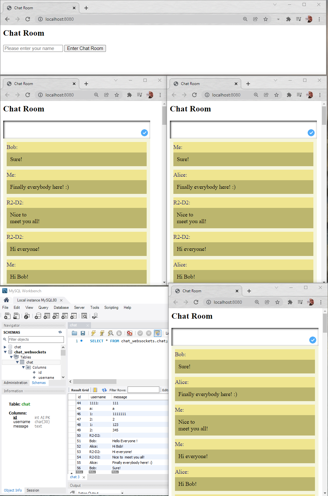

## Java WebSocket Chat Application

##### This is a chat web application with basic functionality, 
##### users can enter their nicknames and see last messages   
##### stored in the DB, all new messages stored also.
##### Could be utilized as network chat.

## Features
- Login
- View previous messages
- Send messages

## Technologies
- Java 11
- Maven
- MySQL
- JDBC
- Javax servlet API
- JSTL
- JSP
- Jackson
- Tomcat 9.0.54 (to run app locally)

## Setup
- Install MySQL.
- Install Tomcat 9.0.54 version.
- Fork or clone this project.
- Create database using init_db.sql file from resources directory.
- Add your credentials to MySQL in ConnectonUtil class (or use default - user: root; password: 1111)
- Deploy this project using Tomcat server.

